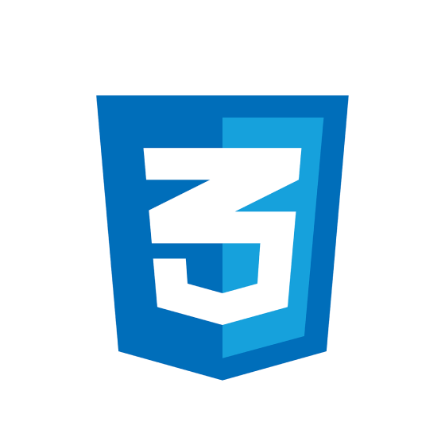
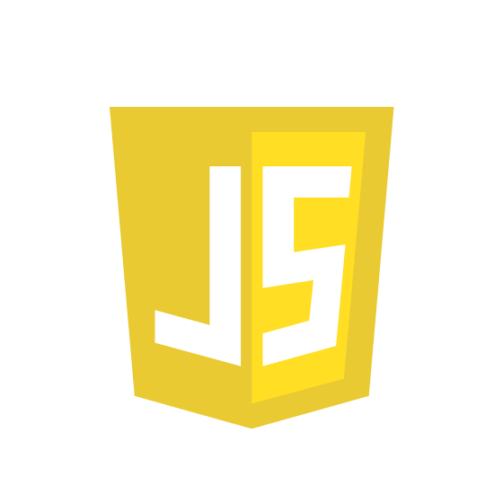
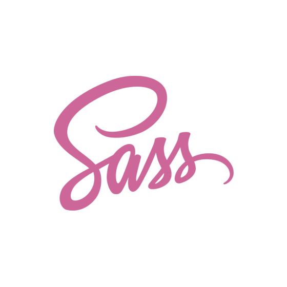
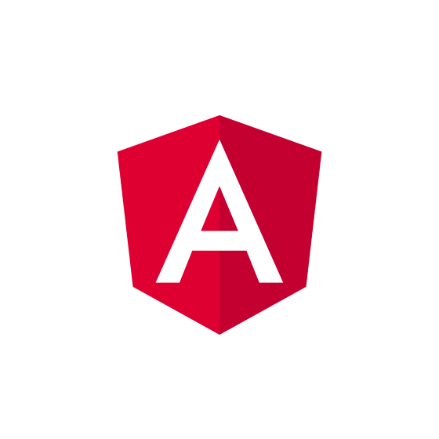
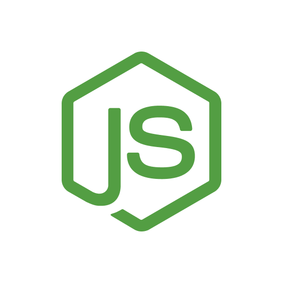
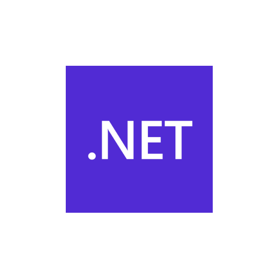

 

I'm an all-in-one developer who loves building complete, high-performance systems — from frontend interfaces to backend infrastructure and everything in between.

- 🧩 **Frontend**: Experienced with modern UI frameworks like **Angular** and **Next.js**, crafting clean, responsive, and dynamic web apps.  
- 🗄️ **Backend**: Skilled in databases like **PostgreSQL**, **SQL Server**, and **Supabase**, building secure and scalable APIs.  
- 🐧 **Linux Tweaker**: I modify and optimize **Linux** environments for extreme productivity, using **DWM** and **Suckless tools** for a minimal, keyboard-driven workflow.  

Always exploring tools that boost performance, reduce bloat, and give full control to the developer.

 

 

 

 

 

 

### 👷 Check out what I'm currently working on

- [rahuljangirwork/mamta-wedding-invitation](https://github.com/rahuljangirwork/mamta-wedding-invitation) - 
- [rahuljangirwork/desktop-wallpapers](https://github.com/rahuljangirwork/desktop-wallpapers) - 
- [rahuljangirwork/Next-Chat](https://github.com/rahuljangirwork/Next-Chat) - A cross-platform ChatGPT/Gemini UI (Web / PWA / Linux / Win / MacOS)
- [rahuljangirwork/metasploit-docker-lab](https://github.com/rahuljangirwork/metasploit-docker-lab) - 
- [rahuljangirwork/rustdesk-api-docker](https://github.com/rahuljangirwork/rustdesk-api-docker) - apt base script
### 🌱 My latest projects

- [rahuljangirwork/mamta-wedding-invitation](https://github.com/rahuljangirwork/mamta-wedding-invitation) - 
- [rahuljangirwork/desktop-wallpapers](https://github.com/rahuljangirwork/desktop-wallpapers) - 
- [rahuljangirwork/metasploit-docker-lab](https://github.com/rahuljangirwork/metasploit-docker-lab) - 
- [rahuljangirwork/rustdesk-api-docker](https://github.com/rahuljangirwork/rustdesk-api-docker) - apt base script
- [rahuljangirwork/rustdesk-relay](https://github.com/rahuljangirwork/rustdesk-relay) - rustserver aws 2023
### 🔨 My recent Pull Requests

- [Codex work merge](https://github.com/isai7710/isai-portfolio/pull/1) on [isai7710/isai-portfolio](https://github.com/isai7710/isai-portfolio)
- [fixbuild](https://github.com/rahuljangirwork/Next-Chat/pull/17) on [rahuljangirwork/Next-Chat](https://github.com/rahuljangirwork/Next-Chat)
- [just gemini](https://github.com/rahuljangirwork/Next-Chat/pull/16) on [rahuljangirwork/Next-Chat](https://github.com/rahuljangirwork/Next-Chat)
- [Devbyrahul](https://github.com/iOfficeAI/AionUi/pull/181) on [iOfficeAI/AionUi](https://github.com/iOfficeAI/AionUi)
- [added user-configurable AI models and custom API keys](https://github.com/r2hu1/rsme-ai/pull/1) on [r2hu1/rsme-ai](https://github.com/r2hu1/rsme-ai)
### ⭐ Recent Stars

- [Aider-AI/aider](https://github.com/Aider-AI/aider) - aider is AI pair programming in your terminal
- [toon-format/toon](https://github.com/toon-format/toon) - 🎒 Token-Oriented Object Notation (TOON) – JSON for LLM prompts at half the tokens. Spec, benchmarks &amp; reference implementation.
- [anthropics/claude-code](https://github.com/anthropics/claude-code) - Claude Code is an agentic coding tool that lives in your terminal, understands your codebase, and helps you code faster by executing routine tasks, explaining complex code, and handling git workflows - all through natural language commands.
- [anthropics/prompt-eng-interactive-tutorial](https://github.com/anthropics/prompt-eng-interactive-tutorial) - Anthropic&#39;s Interactive Prompt Engineering Tutorial
- [yeyushengfan258/Reversal-icon-theme](https://github.com/yeyushengfan258/Reversal-icon-theme) - A colorful Design Rectangle icon theme for linux desktops

