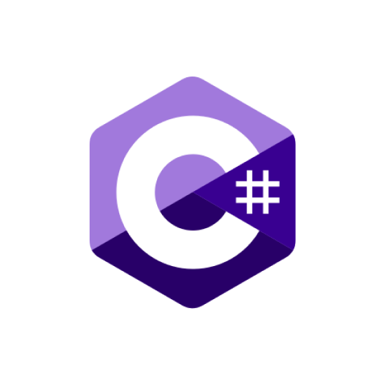
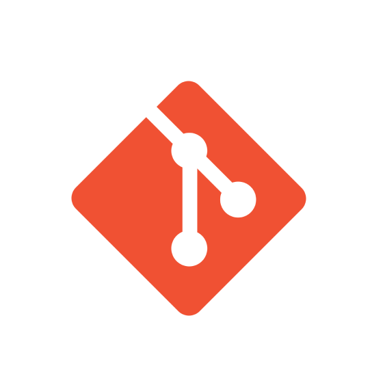

 

I'm an all-in-one developer who loves building complete, high-performance systems — from frontend interfaces to backend infrastructure and everything in between.

- 🧩 **Frontend**: Experienced with modern UI frameworks like **Angular** and **Next.js**, crafting clean, responsive, and dynamic web apps.  
- 🗄️ **Backend**: Skilled in databases like **PostgreSQL**, **SQL Server**, and **Supabase**, building secure and scalable APIs.  
- 🐧 **Linux Tweaker**: I modify and optimize **Linux** environments for extreme productivity, using **DWM** and **Suckless tools** for a minimal, keyboard-driven workflow.  

Always exploring tools that boost performance, reduce bloat, and give full control to the developer.

 

 

 

 

 

 

### 👷 Check out what I'm currently working on

- [rahuljangirwork/labbook](https://github.com/rahuljangirwork/labbook) - 
- [rahuljangirwork/home-lab](https://github.com/rahuljangirwork/home-lab) - 
- [rahuljangirwork/lab](https://github.com/rahuljangirwork/lab) - 
- [rahuljangirwork/mamta-wedding-invitation](https://github.com/rahuljangirwork/mamta-wedding-invitation) - 
- [rahuljangirwork/aws-automation](https://github.com/rahuljangirwork/aws-automation) - 
### 🌱 My latest projects

- [rahuljangirwork/labbook](https://github.com/rahuljangirwork/labbook) - 
- [rahuljangirwork/lab](https://github.com/rahuljangirwork/lab) - 
- [rahuljangirwork/terraform-aws-project](https://github.com/rahuljangirwork/terraform-aws-project) - 
- [rahuljangirwork/aws-automation](https://github.com/rahuljangirwork/aws-automation) - 
- [rahuljangirwork/home-lab](https://github.com/rahuljangirwork/home-lab) - 
### 🔨 My recent Pull Requests

- [add niginx proxies](https://github.com/rahuljangirwork/lab/pull/2) on [rahuljangirwork/lab](https://github.com/rahuljangirwork/lab)
- [make the rustdesk](https://github.com/rahuljangirwork/lab/pull/1) on [rahuljangirwork/lab](https://github.com/rahuljangirwork/lab)
- [Codex work merge](https://github.com/isai7710/isai-portfolio/pull/1) on [isai7710/isai-portfolio](https://github.com/isai7710/isai-portfolio)
- [fixbuild](https://github.com/rahuljangirwork/Next-Chat/pull/17) on [rahuljangirwork/Next-Chat](https://github.com/rahuljangirwork/Next-Chat)
- [just gemini](https://github.com/rahuljangirwork/Next-Chat/pull/16) on [rahuljangirwork/Next-Chat](https://github.com/rahuljangirwork/Next-Chat)
### ⭐ Recent Stars

- [moinulmoin/chadnext](https://github.com/moinulmoin/chadnext) - ChadNext - Quick Starter Template for your Next project includes Next.js 15 App router, Shadcn UI, LuciaAuth, Prisma, Server Actions, Stripe, Internationalization and more.
- [sansan0/TrendRadar](https://github.com/sansan0/TrendRadar) - 🎯 告别信息过载，AI 助你看懂新闻资讯热点，简单的舆情监控分析 - 多平台热点聚合&#43;基于 MCP 的AI分析工具。监控35个平台（抖音、知乎、B站、华尔街见闻、财联社等），智能筛选&#43;自动推送&#43;AI对话分析（用自然语言深度挖掘新闻：趋势追踪、情感分析、相似检索等13种工具）。支持企业微信/个人微信/飞书/钉钉/Telegram/邮件/ntfy/bark/slack 推送，1分钟手机通知，无需编程。支持Docker部署⭐ 让算法为你服务，用AI理解热点
- [Aider-AI/aider](https://github.com/Aider-AI/aider) - aider is AI pair programming in your terminal
- [toon-format/toon](https://github.com/toon-format/toon) - 🎒 Token-Oriented Object Notation (TOON) – Compact, human-readable, schema-aware JSON for LLM prompts. Spec, benchmarks, TypeScript SDK.
- [anthropics/claude-code](https://github.com/anthropics/claude-code) - Claude Code is an agentic coding tool that lives in your terminal, understands your codebase, and helps you code faster by executing routine tasks, explaining complex code, and handling git workflows - all through natural language commands.

